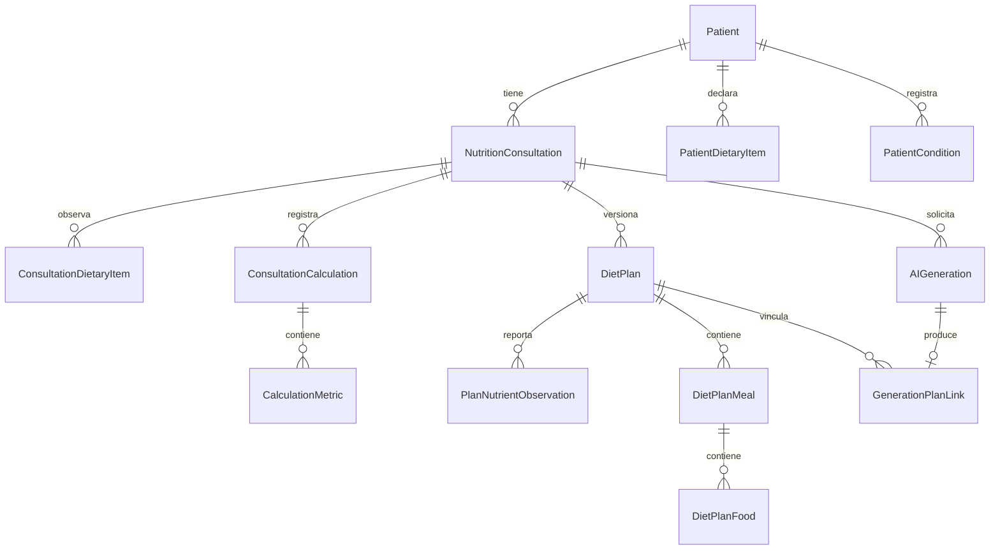

# Diseño de persistencia en tercera forma normal

La migración `202609050003_third_normal_form` normaliza el esquema de la fase 1
sobre Prisma Client Python y SQLite. Los contratos de lectura siguen ofreciendo
los datos solicitados mediante proyecciones de las relaciones.

## Criterio aplicado

Una relación está en 3FN cuando, para cada dependencia funcional no trivial
`X → A`, X es superclave o A es atributo primo (pertenece a una clave candidata).
La revisión considera las dependencias del dominio, no solo la presencia de IDs.

- **1FN:** una preferencia, exclusión o alergia por fila; comidas y alimentos
  independientes. No se usan listas JSON como columnas operativas de preferencias.
- **2FN:** en las relaciones con clave compuesta, el valor depende de la clave
  completa: por ejemplo `(calculationId, metricCode) → value`.
- **3FN:** el plan guarda su consulta, y la consulta guarda su paciente. No se
  guarda `patientId` en `DietPlan`. El vínculo generación-plan está en una sola
  relación y no repite la consulta. Se eliminan las dos referencias recíprocas
  anteriores (`DietPlan.generationId` y `AIGeneration.dietPlanId`).

## Claves y dependencias

| Relación | Claves candidatas / determinante | Dependencia y significado |
| --- | --- | --- |
| Patient | id; demoKey cuando existe | Identidad, contacto y valores habituales del paciente |
| NutritionConsultation | id; demoKey y legacyPlanId cuando existen | Paciente y observaciones de esa consulta |
| DietPlan | id; (consultationId, version) | Consulta, estado y metadatos de esa versión |
| DietPlanMeal | id; (dietPlanId, sortOrder) | Tipo y nombre de esa comida dentro del plan |
| DietPlanFood | id | Alimento, porción y nutrientes registrados para esa porción |
| PatientDietaryItem | id; (patientId, kind, content) | Un hecho dietético habitual; la clave natural impide duplicados |
| ConsultationDietaryItem | id; (consultationId, kind, content) | Un hecho dietético observado en esa consulta |
| PatientCondition | id; (patientId, description) | Una condición o declaración clínica del paciente |
| ConsultationCalculation | id | Consulta, método, versión y momento de un registro de cálculo |
| CalculationMetric | (calculationId, metricCode) | Valor numérico de la métrica en ese registro |
| PlanNutrientObservation | (dietPlanId, metricCode) | Valor nutricional reportado para esa versión |
| AIGeneration | id | Consulta y metadatos de un intento, incluso si falla sin producir plan |
| GenerationPlanLink | generationId | Plan asociado al intento y si fue su origen |
| KnowledgeSource | id | Metadatos de una edición documental |
| RetrievedSource | id | Fragmento efectivamente recuperado, fuente, intento y puntuación |
| PlanValidation | id | Resultado concreto de una validación de un plan |
| DietPlanChangeLog | id | Un cambio registrado, autor y valores anterior/nuevo |
| LegacyPatientSnapshot | patientId | Registro original del paciente al importar |
| LegacyPlanSnapshot | dietPlanId | Documento original y atributos recibidos al importar |

Las claves únicas nullable son identificadores alternativos solo para las filas
que los tienen; no sustituyen a las claves primarias obligatorias.

## Supuestos del dominio y datos históricos

`NutritionConsultation.sex`, edad, peso, talla y preferencias son observaciones
históricas. No son copias que deban actualizarse cuando cambie la ficha actual.
Por ello `patientId` no determina esos valores de consulta. El sexo usado en el
cálculo se mantiene tal como fue registrado.

`Patient.age` es una observación alternativa cuando no se conoce `birthDate`;
un CHECK impide almacenar ambos a la vez. `ageRecordedAt` identifica cuándo se
registró esa observación en este esquema. Para filas importadas es el momento
de importación, no una fecha clínica inferida. La edad actual con fecha de
nacimiento debe calcularse al leer; no persistirse como otra verdad paralela.

Los resultados del cálculo son **observaciones de una ejecución**, no valores
que se recalculan al modificar la consulta. Se permiten múltiples registros y
cada métrica conserva un número. Las unidades están definidas por el código:
kcal/día para energía, gramos/día para macronutrientes y fibra, litros/día para
agua y kg/m² para BMI. No se almacena otra columna de unidad determinada por
`metricCode`. Los resultados históricos se copian, sin ejecutar fórmulas nuevas.

Los nutrientes del plan son valores **reportados para esa versión**, que pueden
diferir de la suma de sus alimentos y deben poder validarse después. La suma
actual se obtendrá de los alimentos. No se declara que ambos valores sean
iguales por definición ni se mantiene una segunda suma editable.

El nombre de un alimento no identifica de forma única composición, preparación,
porción o equivalencia SMAE. `foodName → calories` no es una dependencia de este
dominio. Si se introduce un catálogo de alimentos, deberá relacionarse mediante
su propia clave, conservando las porciones y observaciones históricas.

El nombre de modelo/documento tampoco identifica globalmente una versión; un
código de validación no determina el mensaje concreto con sus parámetros. Una
sección documental puede producir fragmentos distintos. Si fases posteriores
introducen catálogos con nuevas dependencias, será necesario normalizarlos.

Los JSON originales, payloads, detalles de ejecución y textos de auditoría son
documentos opacos de procedencia, no tablas operativas codificadas como texto.
Los snapshots de importación rechazan UPDATE y DELETE mediante triggers. Su
objetivo es conservar exactamente lo recibido, incluso errores o datos que
posteriormente cambien en el modelo operativo. `originalPatientId` es el dato
del documento de origen, no la relación actual del plan con el paciente.

Una narrativa clínica heredada se conserva íntegra como una declaración; no
se divide por comas suponiendo diagnósticos no confirmados. Las listas JSON
explícitas de preferencias se descomponen y deduplican. La migración aborta si
una lista contiene elementos que no son texto, para evitar descartarlos.

## Integridad y compatibilidad

- Claves foráneas con eliminación restringida conservan el historial.
- `(consultationId, version)` es único y la versión es positiva.
- Un índice único parcial permite como máximo una generación de origen por plan.
- Los triggers impiden asociar generaciones y planes de consultas diferentes,
  incluso al cambiar la consulta después de crear el vínculo.
- Se conservan CHECK de estados, severidades, cantidades y retención de payloads.
- `normalized.py` ofrece creaciones y proyecciones PatientRead,
  NutritionConsultationRead y DietPlanRead. Los campos calculados de lectura
  se obtienen de las tablas relacionadas; no deben escribirse directamente
  como columnas de Patient, NutritionConsultation o DietPlan.
- `legacy.py` mantiene los listados actuales con `gender`, `patientId`, estados
  en español y acceso al JSON original. Su `tdee_calculated` representa el
  valor del documento original, no un cálculo vigente.

Los CHECK, triggers y el índice parcial se administran mediante las migraciones
SQL. No usar `prisma db push`, porque no representa todas estas restricciones.

## Migración y verificación

Backup previo: `../data/db/alimentia-before-3nf-20260905-195506.db`.
La migración copia los datos a las nuevas relaciones antes de reconstruir las
tablas, dentro de una transacción. `migrate.py` crea otro respaldo, valida las
claves foráneas y compara pacientes, planes y JSON originales después del deploy.

Las pruebas cubren las relaciones y versiones de la fase 1, normalización de
listas, unicidad de métricas, consultas coherentes, un solo origen, inmutabilidad
de documentos, exclusión fecha de nacimiento/edad, proyecciones y preservación
de datos de la migración anterior. No ejecutan cálculos nutricionales ni LLM.

El ensayo sobre copia conservó 4 pacientes y 3 planes. Se repitió el deploy sin
migraciones pendientes. Las instrucciones de ejecución y recuperación están en
[PHASE1.md](PHASE1.md).

## Resultado local verificado — 5 de septiembre de 2026

- Migración aplicada: `202609050003_third_normal_form`.
- Backup automático del deploy: `../data/db/alimentia-backup-20260905T201405264980.db`.
- Imagen anterior conservada: `alimentia-backend:pre-3nf`.
- 30 pruebas aprobadas en contenedor aislado y 30 en el backend actualizado.
- Prisma valida el esquema; `migrate status` está al día y `migrate diff` no
  detecta diferencias entre las tablas desplegadas y el esquema Prisma.
- SQLite: integridad correcta, sin violaciones de claves foráneas.
- Comparación contra respaldo: campos conservados, documentos originales,
  resultados históricos y tablas de comidas/alimentos preservados.
- Estado final: 4 pacientes, 4 consultas, 3 planes, 1 comida, 1 alimento y
  ninguna generación ficticia.
- Seed ejecutado dos veces: mismos IDs de paciente y consulta; sin duplicados.
- Reinicio real del backend: `/health`, `/api/v1/patients` y `/api/v1/plans`
  respondieron correctamente; los 4 IDs de pacientes y los 3 IDs de planes
  coinciden antes y después.

Archivos modificados: `schema.prisma`, `migrate.py`, `seed.py`,
`src/app/schemas/persistence.py`, `src/app/repositories/legacy.py`,
`tests/test_persistence.py` y `PHASE1.md`. Archivos creados: esta documentación,
`src/app/repositories/normalized.py` y la tercera migración SQL.

Las pruebas detectaron que convertir las relaciones anidadas a diccionarios
introducía atributos extra en el DTO de comidas. Se corrigió la proyección
para validar esos objetos mediante los contratos Pydantic existentes.

La fase 2 puede consumir los contratos de consulta y resultados, y las
relaciones normalizadas de planes, sin duplicar el propietario ni el vínculo
de generación. Queda pendiente la lógica funcional de cálculo, edición y
aprobación de las fases siguientes. Los módulos LLM, RAG, calculator y food_db
conservan los mismos hashes que antes de esta migración. Sigue vigente la deuda
documentada en PHASE1.md sobre los documentos RAG y el modelo local ausentes.
